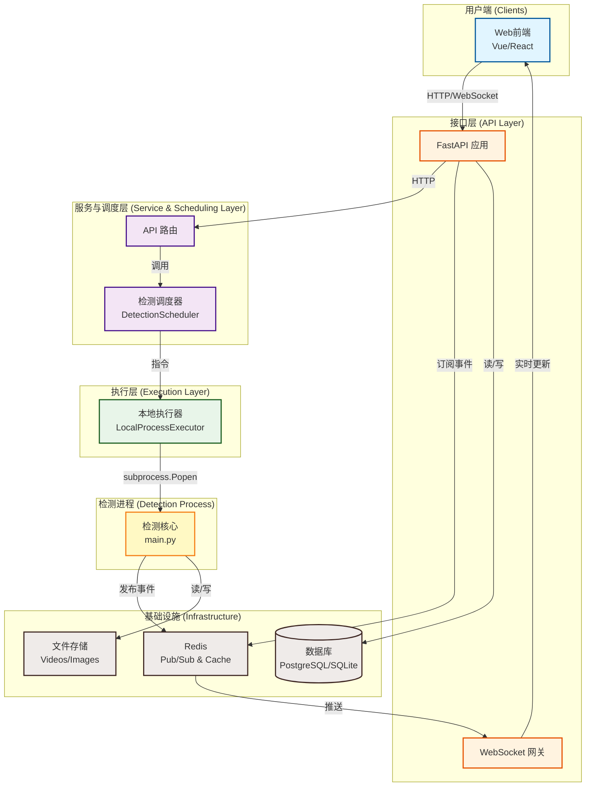
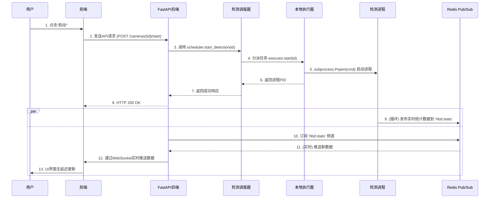

# 系统架构设计

本文档是“人体行为检测系统”的权威架构说明，旨在为所有开发者和维护者提供一个清晰、统一的系统设计蓝图。本文档描述的是项目**当前及未来**遵循的官方架构。

---

## 1. 核心设计哲学

本系统的架构设计遵循以下核心原则：

- **事件驱动 (Event-Driven)**: 核心组件之间通过异步消息进行通信，而非脆弱的文件共享或轮询，以实现低延迟和高可靠性。
- **关注点分离 (Separation of Concerns)**: 严格划分前端、API服务、检测核心和执行单元的职责，使各部分可以独立演进。
- **面向扩展 (Designed for Extension)**: 架构在设计之初就为未来的横向扩展（如分布式检测）和功能扩展（如插件化）预留了接口。
- **状态与逻辑分离 (State-Logic Separation)**: 系统的实时状态（如检测统计）与核心业务逻辑分离，通过独立的缓存层进行管理。

---

## 2. 总体架构图

下图展示了系统的分层结构和核心组件。



---

## 3. 核心架构组件详解

### 3.1. 实时数据总线：Redis Pub/Sub

这是本系统信息交互的命脉，它彻底取代了过去通过解析日志文件进行通信的脆弱方式。

- **职责**: 负责在“检测进程”和“FastAPI后端”之间传递结构化的实时数据。
- **频道 (Channels)**:
    - `hbd:stats`: 用于发布实时的性能与检测统计数据（如FPS、检测人数等）。
    - `hbd:events`: 用于发布关键的业务事件（如发现违规行为）。
- **消息格式**: 所有消息均为JSON字符串，确保了通信的规范性和可扩展性。
    ```json
    // "hbd:stats" 频道消息示例
    {
      "type": "stats",
      "camera_id": "vid1",
      "timestamp": 1678886400.123,
      "data": { "fps": 15.2, "persons": 2, "hairnets": 1 }
    }
    ```
- **优势**:
    - **实时性**: 数据延迟从秒级降低到毫秒级。
    - **可靠性**: 解除了API与日志格式的强耦合，避免了文件读写冲突。
    - **高性能**: API后端通过监听消息直接更新内存缓存，响应速度极快。

### 3.2. 抽象调度层：调度器与执行器

这是本系统实现可扩展性的基石。它将“启动一个检测”的**意图**与“具体如何执行”的**实现**进行解耦。

- **检测调度器 (DetectionScheduler)**:
    - **职责**: 作为API层和执行层之间的桥梁，接收来自API路由的启动/停止任务的指令。
    - **特点**: 它不关心任务具体如何执行，只负责将任务分派给一个或多个“执行器”。

- **执行器 (Executor)**:
    - **职责**: 负责以一种具体的方式启动、停止和监控检测进程。
    - **当前实现**: `LocalProcessExecutor`，其唯一职责是在本地服务器上通过 `subprocess` 启动进程。
    - **未来扩展**: 可以轻易地添加新的执行器，而无需改动上层任何代码。例如：
        - `DockerExecutor`: 通过Docker API在容器中启动检测进程。
        - `SshExecutor`: 通过SSH在另一台远程服务器上启动检测进程。
        - `KubernetesExecutor`: 通过Kubernetes API创建一个Job来执行检测任务。

**调用流程**:
`API路由` -> `DetectionScheduler.start()` -> `(当前)LocalProcessExecutor.start()` -> `subprocess.Popen()`

这种设计使得系统架构具备了极强的灵活性和生命力，能够平滑地从单机部署演进到分布式集群部署。

---

## 4. 启动检测的完整流程 (最新版)

旧的流程依赖于前端轮询和后端解析日志，现已废弃。**以下为当前标准的、基于事件驱动的完整流程**：



**流程说明**:
1.  **任务启动**: 用户通过前端发起API请求，该请求经过调度器和执行器，最终在服务器上启动一个独立的检测进程。
2.  **数据发布**: 检测进程在运行时，不再将详细统计写入日志文件，而是将结构化的JSON数据实时发布到Redis的`hbd:stats`频道。
3.  **实时订阅与推送**: FastAPI后端在启动时就订阅了`hbd:stats`频道。一旦接收到来自Redis的新消息，它会立即通过WebSocket将数据推送给所有连接的前端客户端。
4.  **前端展示**: 前端不再需要定时轮询，而是被动接收后端推送的数据，并实时更新UI界面。

---

## 5. 部署架构

系统支持灵活的部署模式，以下为推荐的生产环境部署架构。

```mermaid
graph TD
    subgraph "基础设施 (Infrastructure)"
        PROD_DB[(数据库<br/>PostgreSQL)]
        PROD_REDIS[Redis]
        PROD_STORAGE[NFS/S3<br/>视频/模型存储]
    end

    subgraph "Docker 容器化环境 (Docker Compose)"
        NGINX[Nginx<br/>反向代理/负载均衡]

        subgraph "应用服务 (App Service)"
            FASTAPI_APP[FastAPI 应用<br/>(可多副本)]
        end

        subgraph "检测服务 (Detection Service)"
            DETECTOR_1[检测进程 1<br/>(Camera 1)]
            DETECTOR_2[检测进程 2<br/>(Camera 2)]
            DETECTOR_N[...]
        end
    end

    USER[用户] --> NGINX
    NGINX --> FASTAPI_APP

    FASTAPI_APP -- "读/写" --> PROD_DB
    FASTAPI_APP -- "订阅/发布" --> PROD_REDIS

    DETECTOR_1 -- "发布" --> PROD_REDIS
    DETECTOR_2 -- "发布" --> PROD_REDIS
    DETECTOR_N -- "发布" --> PROD_REDIS

    DETECTOR_1 -- "读" --> PROD_STORAGE
    DETECTOR_2 -- "读" --> PROD_STORAGE
    DETECTOR_N -- "读" --> PROD_STORAGE

    classDef user fill:#cde4ff
    classDef infra fill:#e1e2e1
    classDef docker fill:#f5f5f5
    classDef app fill:#d4edda
    classDef detector fill:#fff3cd

    class USER user
    class PROD_DB,PROD_REDIS,PROD_STORAGE infra
    class NGINX,FASTAPI_APP,DETECTOR_1,DETECTOR_2,DETECTOR_N docker
    class FASTAPI_APP app
    class DETECTOR_1,DETECTOR_2,DETECTOR_N detector
```

此架构通过将FastAPI应用与检测进程分离，并利用Redis作为通信总线，实现了高度的解耦和可扩展性。未来可以通过增加检测节点的服务器来轻易地扩展整个系统的计算能力。
