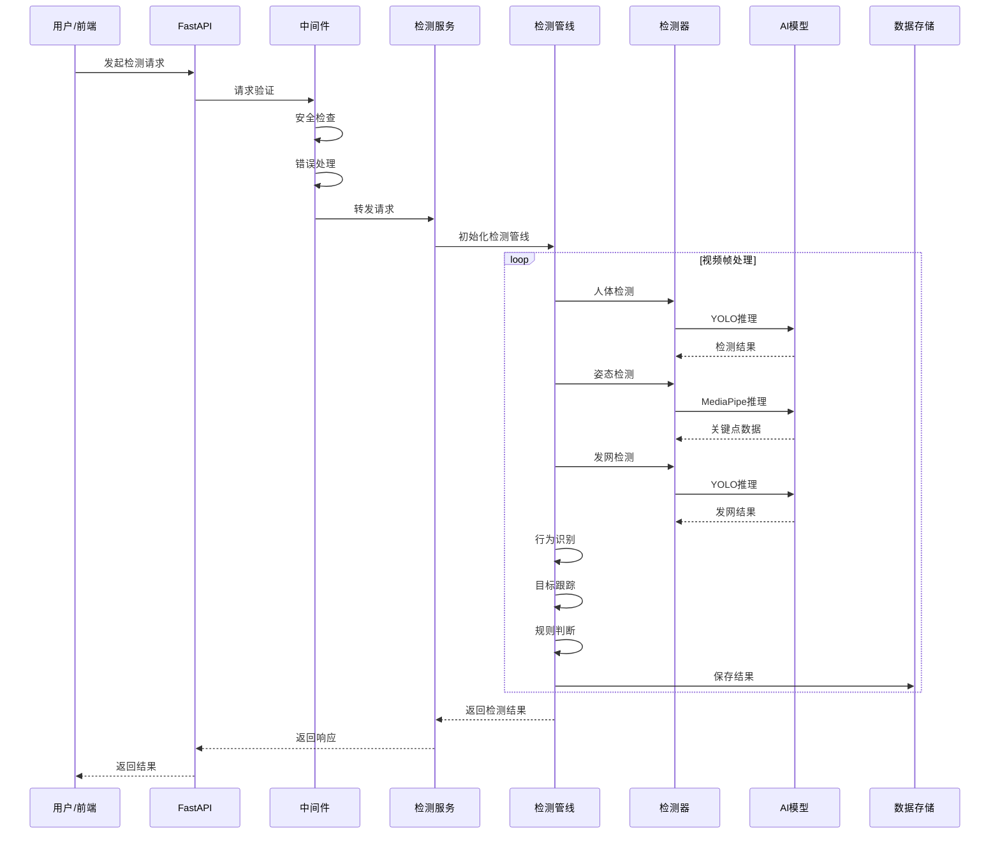
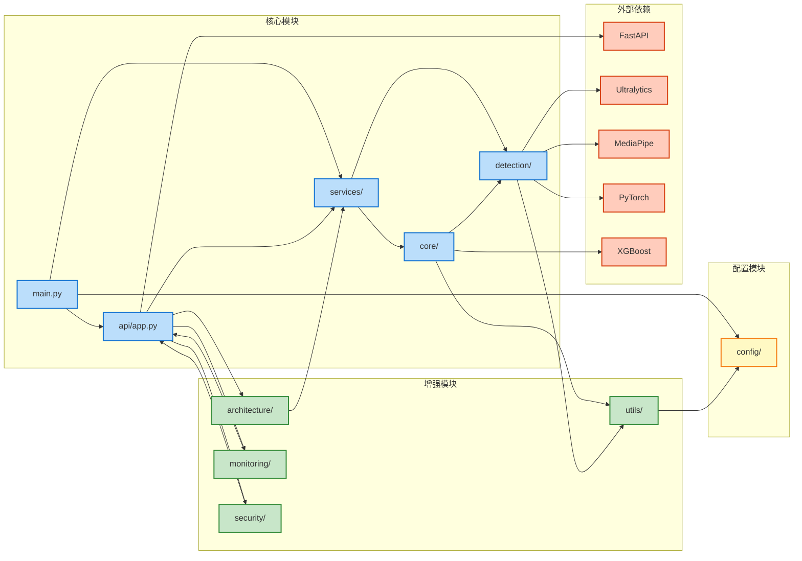
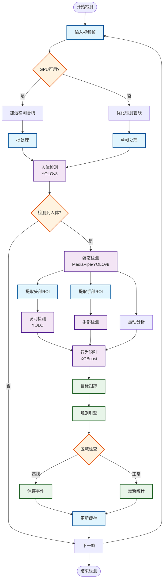
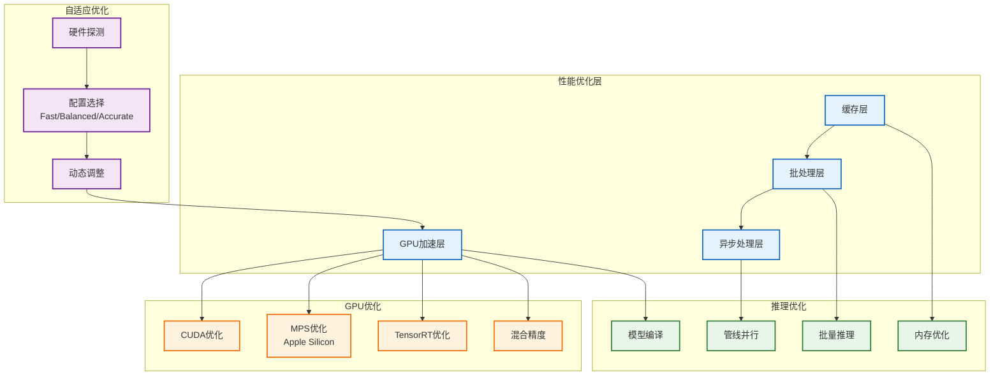
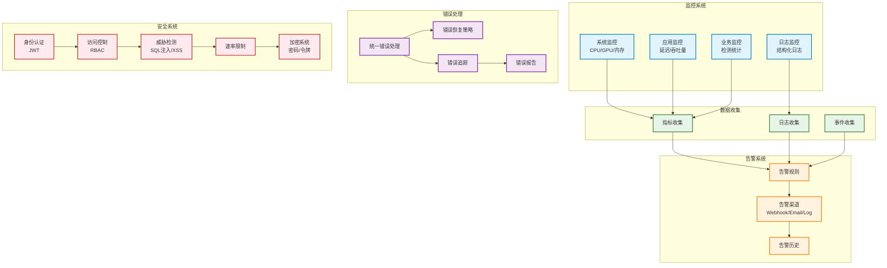
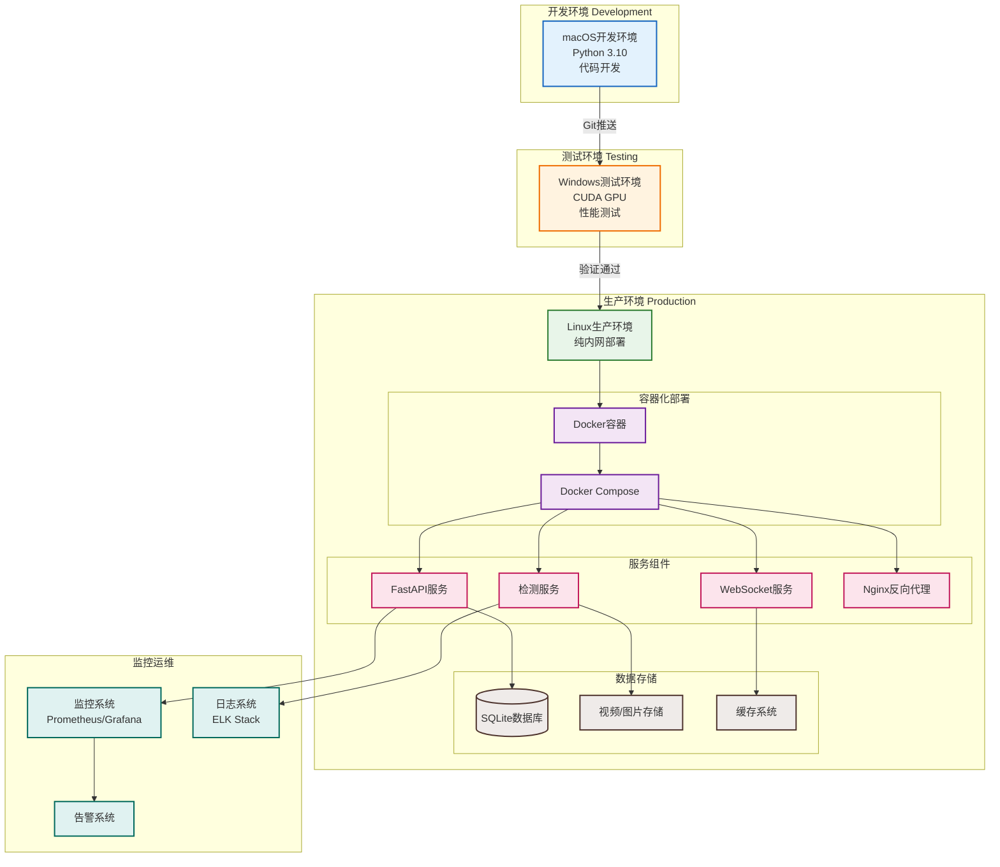
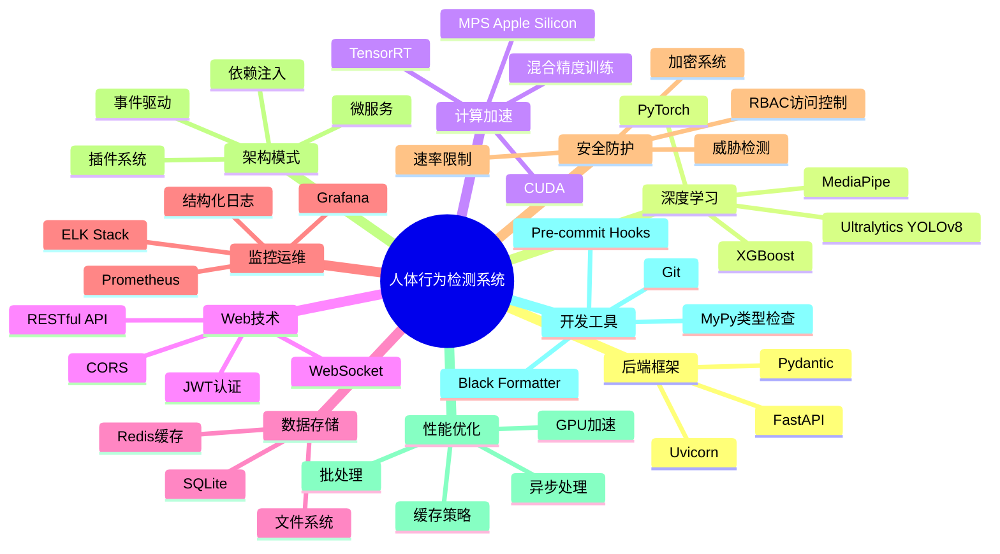

# 人体行为检测系统架构图

## 总体架构图

```mermaid
graph TB
    subgraph "用户层 User Layer"
        WEB[Web前端<br/>HTML/CSS/JS]
        CLI[命令行界面<br/>CLI]
        API_CLIENT[API客户端<br/>Third-party Apps]
    end

    subgraph "接口层 API Layer"
        FASTAPI[FastAPI应用<br/>app.py]
        WS[WebSocket服务<br/>websocket_service.py]

        subgraph "中间件 Middleware"
            ERR_MW[错误处理中间件<br/>error_middleware.py]
            SEC_MW[安全中间件<br/>security_middleware.py]
            CORS[CORS中间件]
        end

        subgraph "路由 Routers"
            R_DETECT[检测路由<br/>comprehensive.py]
            R_CAMERA[摄像头路由<br/>cameras.py]
            R_REGION[区域管理<br/>region_management.py]
            R_STATS[统计路由<br/>statistics.py]
            R_EVENTS[事件路由<br/>events.py]
            R_SYSTEM[系统路由<br/>system.py]
            R_SECURITY[安全路由<br/>security.py]
            R_MONITOR[监控路由<br/>error_monitoring.py]
        end
    end

    subgraph "业务服务层 Service Layer"
        DETECT_SVC[检测服务<br/>detection_service.py]
        CAPTURE_SVC[捕获服务<br/>capture_service.py]
        REGION_SVC[区域服务<br/>region_service.py]
        VIDEO_SVC[视频服务<br/>video_service.py]
        PROC_MGR[进程管理器<br/>process_manager.py]
        PROC_ENG[进程引擎<br/>process_engine.py]
        RT_VIDEO[实时视频检测<br/>realtime_video_detection.py]
    end

    subgraph "核心检测层 Core Detection Layer"
        subgraph "检测管线 Detection Pipelines"
            OPT_PIPE[优化检测管线<br/>OptimizedDetectionPipeline]
            ACC_PIPE[加速检测管线<br/>AcceleratedDetectionPipeline]
            FAST_PIPE[快速检测管线<br/>FastDetectionPipeline]
        end

        subgraph "核心组件 Core Components"
            BEHAVIOR[行为识别器<br/>BehaviorRecognizer]
            TRACKER[目标跟踪器<br/>ObjectTracker]
            REGION[区域管理器<br/>RegionManager]
            RULE_ENG[规则引擎<br/>RuleEngine]
            QUALITY[质量评估器<br/>QualityAssessor]
            PERSON_ENG[个性化引擎<br/>PersonalizationEngine]
            DATA_MGR[数据管理器<br/>DataManager]
        end
    end

    subgraph "检测器层 Detector Layer"
        HUMAN_DET[人体检测器<br/>HumanDetector<br/>YOLO]
        POSE_DET[姿态检测器<br/>PoseDetector<br/>MediaPipe/YOLOv8]
        HAIRNET_DET[发网检测器<br/>YOLOHairnetDetector]
        HAND_DET[手部检测器<br/>EnhancedHandDetector]
        MOTION_ANA[运动分析器<br/>MotionAnalyzer]
        DEEP_BEH[深度行为识别<br/>DeepBehaviorRecognizer]
    end

    subgraph "架构增强层 Architecture Layer"
        DI[依赖注入<br/>DependencyInjection]
        EVENT_SYS[事件系统<br/>EventSystem]
        PLUGIN_SYS[插件系统<br/>PluginSystem]
        ARCH_ANA[架构分析器<br/>ArchitectureAnalyzer]
    end

    subgraph "监控安全层 Monitoring & Security Layer"
        ADV_MON[高级监控<br/>AdvancedMonitoring]
        STRUCT_LOG[结构化日志<br/>StructuredLogging]
        ERR_MON[错误监控<br/>ErrorMonitor]
        ERR_HANDLER[错误处理器<br/>ErrorHandler]
        SEC_MGR[安全管理器<br/>SecurityManager]
    end

    subgraph "工具层 Utility Layer"
        GPU_ACC[GPU加速<br/>GPUAcceleration]
        ADAPTIVE_OPT[自适应优化<br/>AdaptiveOptimizer]
        HW_PROBE[硬件探测<br/>HardwareProbe]
        IMG_UTILS[图像工具<br/>ImageUtils]
        VIDEO_UTILS[视频工具<br/>VideoUtils]
        FILE_UTILS[文件工具<br/>FileUtils]
        DATA_COLLECT[数据收集器<br/>DataCollector]
    end

    subgraph "配置层 Configuration Layer"
        UNIFIED_CFG[统一参数<br/>UnifiedParams]
        MODEL_CFG[模型配置<br/>ModelConfig]
        CAMERA_CFG[摄像头配置<br/>CameraConfig]
        SETTINGS[设置<br/>Settings]
    end

    subgraph "数据存储层 Data Storage Layer"
        DB[(SQLite数据库<br/>detection_results.db)]
        FILES[文件存储<br/>Videos/Images]
        CACHE[缓存<br/>Redis/Memory]
    end

    subgraph "AI模型层 AI Models Layer"
        YOLO_HUMAN[YOLOv8人体检测<br/>yolov8n.pt]
        YOLO_HAIRNET[YOLOv8发网检测<br/>hairnet_best.pt]
        MEDIAPIPE[MediaPipe姿态<br/>pose_landmarker]
        XGB_MODEL[XGBoost行为<br/>handwash_xgb.json]
    end

    %% 用户层到接口层
    WEB --> FASTAPI
    CLI --> FASTAPI
    API_CLIENT --> FASTAPI
    WEB --> WS

    %% 接口层到中间件
    FASTAPI --> ERR_MW
    FASTAPI --> SEC_MW
    FASTAPI --> CORS

    %% 中间件到路由
    ERR_MW --> R_DETECT
    ERR_MW --> R_CAMERA
    ERR_MW --> R_REGION
    ERR_MW --> R_STATS
    ERR_MW --> R_EVENTS
    ERR_MW --> R_SYSTEM
    ERR_MW --> R_SECURITY
    ERR_MW --> R_MONITOR

    %% 路由到服务层
    R_DETECT --> DETECT_SVC
    R_CAMERA --> CAPTURE_SVC
    R_CAMERA --> PROC_MGR
    R_REGION --> REGION_SVC
    R_STATS --> DETECT_SVC
    R_EVENTS --> DETECT_SVC
    WS --> RT_VIDEO

    %% 服务层到核心检测层
    DETECT_SVC --> OPT_PIPE
    DETECT_SVC --> ACC_PIPE
    CAPTURE_SVC --> FAST_PIPE
    RT_VIDEO --> OPT_PIPE
    PROC_MGR --> PROC_ENG
    PROC_ENG --> OPT_PIPE

    %% 检测管线到核心组件
    OPT_PIPE --> BEHAVIOR
    OPT_PIPE --> TRACKER
    OPT_PIPE --> REGION
    OPT_PIPE --> RULE_ENG
    ACC_PIPE --> QUALITY
    ACC_PIPE --> PERSON_ENG
    FAST_PIPE --> DATA_MGR

    %% 核心组件到检测器层
    BEHAVIOR --> HUMAN_DET
    BEHAVIOR --> POSE_DET
    BEHAVIOR --> HAIRNET_DET
    TRACKER --> HUMAN_DET
    REGION --> HAND_DET
    RULE_ENG --> MOTION_ANA
    QUALITY --> DEEP_BEH

    %% 检测器层到AI模型层
    HUMAN_DET --> YOLO_HUMAN
    HAIRNET_DET --> YOLO_HAIRNET
    POSE_DET --> MEDIAPIPE
    BEHAVIOR --> XGB_MODEL

    %% 架构增强层
    DI --> DETECT_SVC
    DI --> CAPTURE_SVC
    EVENT_SYS --> OPT_PIPE
    PLUGIN_SYS --> FASTAPI
    ARCH_ANA --> DI

    %% 监控安全层
    ADV_MON --> FASTAPI
    STRUCT_LOG --> FASTAPI
    ERR_MON --> ERR_HANDLER
    ERR_HANDLER --> FASTAPI
    SEC_MGR --> SEC_MW
    R_SECURITY --> SEC_MGR
    R_MONITOR --> ERR_MON

    %% 工具层
    GPU_ACC --> HUMAN_DET
    GPU_ACC --> POSE_DET
    ADAPTIVE_OPT --> OPT_PIPE
    HW_PROBE --> GPU_ACC
    IMG_UTILS --> HUMAN_DET
    VIDEO_UTILS --> CAPTURE_SVC
    FILE_UTILS --> VIDEO_SVC
    DATA_COLLECT --> ADV_MON

    %% 配置层
    UNIFIED_CFG --> OPT_PIPE
    MODEL_CFG --> HUMAN_DET
    CAMERA_CFG --> CAPTURE_SVC
    SETTINGS --> FASTAPI

    %% 数据存储层
    DETECT_SVC --> DB
    VIDEO_SVC --> FILES
    OPT_PIPE --> CACHE
    DATA_MGR --> DB

    %% 样式定义
    classDef userLayer fill:#e1f5ff,stroke:#01579b,stroke-width:2px
    classDef apiLayer fill:#fff3e0,stroke:#e65100,stroke-width:2px
    classDef serviceLayer fill:#f3e5f5,stroke:#4a148c,stroke-width:2px
    classDef coreLayer fill:#e8f5e9,stroke:#1b5e20,stroke-width:2px
    classDef detectorLayer fill:#fff9c4,stroke:#f57f17,stroke-width:2px
    classDef architectureLayer fill:#fce4ec,stroke:#880e4f,stroke-width:2px
    classDef monitoringLayer fill:#e0f2f1,stroke:#004d40,stroke-width:2px
    classDef utilityLayer fill:#f1f8e9,stroke:#33691e,stroke-width:2px
    classDef configLayer fill:#ede7f6,stroke:#311b92,stroke-width:2px
    classDef dataLayer fill:#efebe9,stroke:#3e2723,stroke-width:2px
    classDef modelLayer fill:#ffebee,stroke:#b71c1c,stroke-width:2px

    class WEB,CLI,API_CLIENT userLayer
    class FASTAPI,WS,ERR_MW,SEC_MW,CORS,R_DETECT,R_CAMERA,R_REGION,R_STATS,R_EVENTS,R_SYSTEM,R_SECURITY,R_MONITOR apiLayer
    class DETECT_SVC,CAPTURE_SVC,REGION_SVC,VIDEO_SVC,PROC_MGR,PROC_ENG,RT_VIDEO serviceLayer
    class OPT_PIPE,ACC_PIPE,FAST_PIPE,BEHAVIOR,TRACKER,REGION,RULE_ENG,QUALITY,PERSON_ENG,DATA_MGR coreLayer
    class HUMAN_DET,POSE_DET,HAIRNET_DET,HAND_DET,MOTION_ANA,DEEP_BEH detectorLayer
    class DI,EVENT_SYS,PLUGIN_SYS,ARCH_ANA architectureLayer
    class ADV_MON,STRUCT_LOG,ERR_MON,ERR_HANDLER,SEC_MGR monitoringLayer
    class GPU_ACC,ADAPTIVE_OPT,HW_PROBE,IMG_UTILS,VIDEO_UTILS,FILE_UTILS,DATA_COLLECT utilityLayer
    class UNIFIED_CFG,MODEL_CFG,CAMERA_CFG,SETTINGS configLayer
    class DB,FILES,CACHE dataLayer
    class YOLO_HUMAN,YOLO_HAIRNET,MEDIAPIPE,XGB_MODEL modelLayer
```

## 数据流图

## 模块依赖图

## 检测管线流程图

## 性能优化架构图

## 监控与安全架构图

## 部署架构图

## 技术栈图

---

## 架构特点说明

### 1. **分层架构**
- **用户层**: Web前端、CLI、API客户端
- **接口层**: FastAPI + 中间件 + 路由
- **服务层**: 业务逻辑服务
- **核心层**: 检测管线和核心组件
- **检测器层**: 各类AI检测器
- **工具层**: 通用工具和优化组件

### 2. **核心优势**
- ✅ **高性能**: GPU加速、批处理、异步处理
- ✅ **高可用**: 错误处理、监控告警、自动恢复
- ✅ **高安全**: 身份认证、访问控制、威胁检测
- ✅ **易扩展**: 依赖注入、事件驱动、插件系统
- ✅ **易维护**: 结构化日志、监控系统、架构分析

### 3. **技术创新**
- 🚀 **自适应优化**: 根据硬件自动选择最优配置
- 🚀 **多后端支持**: MediaPipe、YOLOv8姿态检测
- 🚀 **企业级监控**: 多维度指标、实时告警
- 🚀 **现代化架构**: DI、事件系统、插件化

### 4. **部署方式**
- 📦 **容器化**: Docker + Docker Compose
- 📦 **多环境**: 开发(macOS) → 测试(Windows GPU) → 生产(Linux)
- 📦 **纯内网**: 支持内网环境部署
